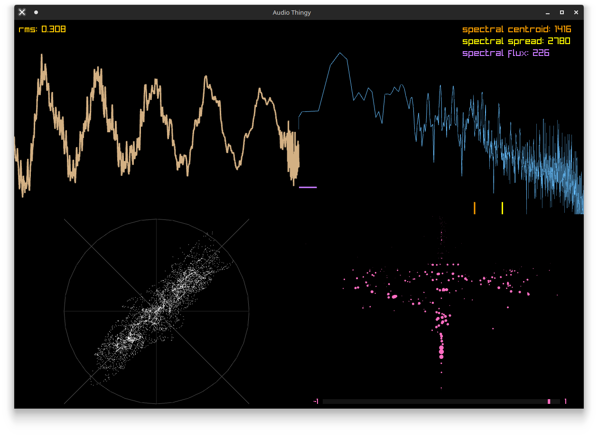

# Audio visualizer

This project is a playground for experimenting with some algorithms to retrieve audio info.

The audio analysis thread is not really optimized and does some silly stuff, like recalculating some fft a bunch of times, but it's fine for the purpose.

You can run it with a file you throw in the folder with `odin run src/. -- filename.wav`.

I tried it with mp3 and wav.

## requirements

You need the odin compiler to run this project.
https://odin-lang.org/docs/install/
